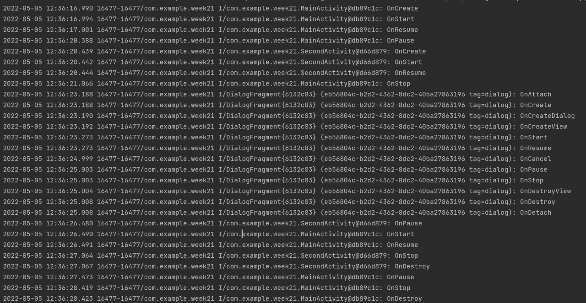

# Задание

## Неделя 2: Жизненный цикл Activity и Fragment

>2.1. Сделать новое мобильное приложение в котором завести два активити, одна открывается из другой, и из нее открывается AlertDialog\
2.2. Обложить логами методы жизненного цикла активити\
2.3. Открывать-закрывать-сворачивать экраны и смотреть что в какой последовательности вызывается\
2.4. Посмотреть картинку про жизненный цикл Activity в документации, выяснить все ли понятно, если что-то непонятно, надо это прояснить

>2.5. Сделать новое мобильное приложение в котором завести два активити с двумя фрагментами, один открывается из другого, и из него открывается AlertDialog\
2.6. Обложить логами методы жизненного цикла\
2.7. Открывать-закрывать-сворачивать экраны и смотреть что в какой последовательности вызывается\
2.8. Посмотреть картинку про жизненный цикл Fragment в документации, выяснить все ли понятно, если что-то непонятно, надо это прояснить

>2.9. Выявить отличия жизненного цикла фрагмента от жизненного цикла активити, ответить на вопрос - для чего нужны эти отличия, почему они возникли?\
2.10. Описать в комментарии к основному экрану - для чего нужен жизненный цикл и какие задачи можно с помощью него решать\
2.11. Привести 3 примера использования жизненного цикла в реальных приложениях

# Выполнение

### week2.1 - выполнение задание 2.1-2.4

Были разработан первая автивити (MainActivity), из которой вызывается второй активити (SecondActivity), из нее вызывается Alert Dialog с помощью Dialog Fragment\
Пример работы приложения при вызове разных компонентов с записью в логах что сейчас вызывается:\

ЖЦ activity:

>**onCreate()** вызывается при создании или перезапуска активности

>**onStart()** окно ещё не видно пользователю, но вскоре будет видно, всегда после onCreate, но перед ним также может быть *onRestart()*

>**onResume()** вызывается после *onStart()** или *onPause()**. В этот момент пользователь взаимодействует с окном

>**onPause()** когда пользователь решает перейти к работе с новым окном, система вызовет для прерываемого окна.
От него можно перейти к вызову либо *onResume()*, либо *onStop()*

>**onStop()** Вызывается непосредственно перед тем, как активность становится видимой пользователю, но еще не видима. Это может произойти при её уничтожении, или если была запущена другая активность.\

>**onRestart()** вызывается после того, как активность была остановлена и снова была запущена пользователем. Всегда сопровождается вызовом метода *onStart()*\

>**onDestroy()** Метод вызывается по окончании работы активности, при вызове метода finish() или в случае, когда система уничтожает этот экземпляр активности для освобождения ресурсов

### week2.5 - выполнение задание 2.5-2.8

Были разработан автивити (MainActivity), из которой вызывается первый фрагмент (FirstFragment), из которой вызывается второй фрагмент (SecondFragment), из нее вызывается Alert Dialog с помощью Dialog Fragment\
Пример работы приложения при вызове разных компонентов с записью в логах что сейчас вызывается:\

ЖЦ фрагмента:

По большей части аналогичен ЖЦ activity, однако есть различия в виде **onCreateView()**, **onViewCreated()**,  **onViewStateRestored()**,**onViewStateRestored()**, **onDestroyView()**.
*onCreateView* также присутсвует в активити, но не как метод ЖЦ\
>**onCreateView())** Вызывается для создания компонентов внутри фрагмента, т.е. в нем используется все, что связанно с граффическим интерфейсом\
Данный метод нужен потому, что *onCreate() Fragment*  может быть вызван, когда *onCreate() Activity* не завершен, и поэтому попытка получить доступ к иерархии view может привести к сбою

>**onViewCreated()** Вызывается сразу после onCreateView()

>**onViewStateRestored()** Вызывается, когда все сохраненное состояние было восстановлено в иерархии представлений фрагмента.

>**onSaveInstanceState()** Сохранаяет состояние объектов для последующего восстановления при повороте экрана

>**onDestroyView()** Вызывается, когда набор компонентов удаляется из фрагмента

## Для чего нужен ЖЦ?

ЖЦ нужен для правильной и надежной работы приложения, например для приложении с проигрыванием видео: если пользователь закрыл приложение, видео останавливается, если вернулся, то возобновляет видео, или правильную работы при получении вызова. Т.е. приложение будет знать, как вести себя в той или иной ситуациито позволит избежать сбоев и обеспечит правильную работу

## Пример работы в приложениях

>Telegram: https://github.com/DrKLO/Telegram/blob/master/TMessagesProj/src/main/java/org/telegram/ui/ChatActivity.java\
В телеграме представлены почти все компоненты ЖЦ
onPause() выключает меню

>VLC media player: https://github.com/m-damavandi/Android-VLC-Sample/blob/master/app/src/main/java/com/damavandi/androidVlcSample/PlayerFragment.java\
onDestroy() освобождает ресурсы mMediaPlayer.release()

>Amaze File Manager: https://github.com/TeamAmaze/AmazeFileManager/blob/hotfix/3.7.1/app/src/main/java/com/amaze/filemanager/ui/fragments/MainFragment.java/
onViewCreated() задает OnTouchListener при нажати останавливается анимация
